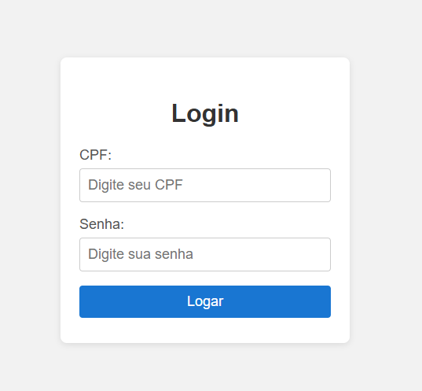

# 🔐 Login Page

Simple login page developed to practice basic HTML and CSS skills.

## 📸 Project Preview

## 🛠️ Technologies

- HTML
- CSS

## ⚙️ Features

- Basic login form  
- Clean and simple layout  
- Responsive design  

## 🎯 Project Goal

Practice building a simple login interface using HTML forms and CSS styling.

## 📚 Context

One of my first projects, created during the early stages of my Front-End learning journey.

## 👨‍💻 Author

Luis Francisco